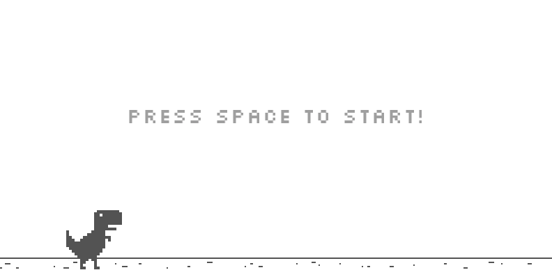

# DinoRun
A clone of the T-Rex endless runner game of Google Chrome written in C# and MonoGame

About
------
I created this project to teach myself MonoGame, This isn't a carbon copy of the original Chrome T-Rex game. Feel free to fork it
and modify my code!

How to play
-----------
Press space to jump and restart the game, press the D key to toggle hitbox visibility.

Score
------
The Score gets saved in the User/AppData/Roaming directory in the folder DinoRunGame

Credits
-------
Graphics:
I took the assets from this repository https://github.com/wayou/t-rex-runner

Animation:
The animation class is a modified version of this tutorial http://rbwhitaker.wikidot.com/monogame-texture-atlases-2

Collision Detection from: https://github.com/dotnet-ad/Humper
